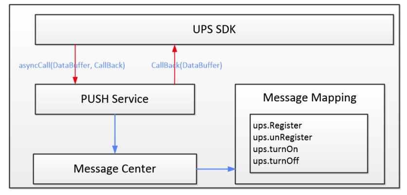
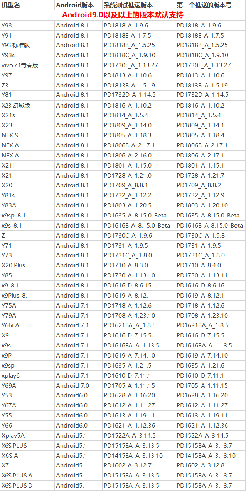
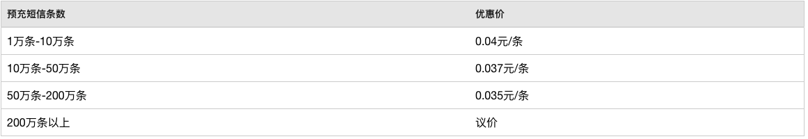
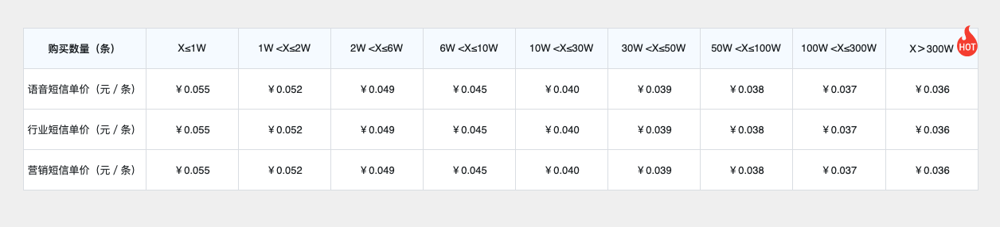

# Android 消息推送服务
----
# 全球
## FCM
最初Google提供的官方推送服务为Google Cloud Message（GCM）,但2018年4月10日Google宣布弃用GCM，2019年5月29日GCM服务器和客户端API被删除，所以现在全球范围内针对Android的推送为Firebase Cloud Messaging（FCM）。

[GCM与FCM疑问解答](https://developers.google.com/cloud-messaging/faq)

FCM可以理解为前文提到的手机厂商通道，Google厂商提供的，在具有Google Play Service 的手机上且网络允许的情况下，App未运行也可以收到云端消息通知。

[FCM官方文档](https://firebase.google.com/docs/cloud-messaging/android/client?authuser=1)

# 中国
## 1. 统一推送联盟
### 1.1 简介
介绍消息推送之前简单提一下 统一推送联盟。

**简介**：中国信息通信研究院泰尔终端实验室联合各大手机厂商和提供推送服务的互联网厂家成立的“统一推送联盟”。
**目的** ：通过标准化统一通道层，降低终端功耗、提升用户体验、支撑开发者生态建设，促进安卓推送服务行业健康发展，为终端用户提供更好的手机使用体验，为应用开发者解决消息推送需求。
**成果**：发布了《统一推送通道层接口规范》，各推送服务商按接口完成统一推送适配，但服务器还是各自厂商自己维护的，并不是统一工信部管理推送服务器。
**官网**：http://www.chinaupa.com/

### 1.2 移动端接口规范
引用《统一推送通道层接口规范》中的内容，移动端接口总方案图如下，UPS (Unified Push Server)。



定义通用的请求，通过方法名进行实现扩展。

### 1.3 统一推送联盟API介绍

- 申请Token
```java
    public static void registerToken(
            Context context, String appID, String appKey, String appSecret, UPSRegisterCallBack callback
    );
```
UPSRegisterCallBack 中获取Token。
- 注销Token
```java
    public static void unRegisterToken (Context context, UPSUnRegisterCallBack callback);
```
- 开启推送
```java
    public static void turnOnPush (Context context, UPSTurnCallBack callback);
```
- 关闭推送
```java
    public static void turnOffPush (Context context, UPSTurnCallBack callback);
```

目前极光推送的API文档中实现比较完整。 [极光推送统一推送API](https://docs.jiguang.cn//jpush/client/Android/android_api/ "统一推送API") 

## 2. 手机厂商推送
### 2.1 开发文档
- [华为推送](https://developer.huawei.com/consumer/cn/doc/development/HMS-Guides/push-introduction "华为")
- [小米推送](https://dev.mi.com/console/doc/detail?pId=230 "小米")
- [魅族推送](http://open-wiki.flyme.cn/doc-wiki/index#id?129 "魅族")
- [OPPO推送](https://open.oppomobile.com/wiki/doc#id=10195 "OPPO")
- [vivo推送](https://dev.vivo.com.cn/documentCenter/doc/180 "VIVO")

想要保证App被杀死的情况下也能收到推送，只有集成上述厂商推送，并运行在该厂商的手机系统中。

### 2.2 注意事项
#### 2.2.1 OPPO推送

1. OPPO手机应用消息推送为默认关闭，需要用户手动开启。
2. 应用需在OPPO软件商店上架（A级应用？），且主营业务不为借贷类的应用。
3. 目前只支持通知栏消息，透传消息暂不支持。

#### 2.2.2 vivo推送

1. 推送目前只针对在vivo商店上架的APK安装包，其它来源APK不保证推送及时性；
2. 目前禁止凌晨向用户推送不必要的消息，具体时间点为22:00-07:00；
3. 推送不允许接入彩票、竞拍、借贷、游戏等应用；
4. vivo手机应用的通知权限默认是关闭的，如果接入了vivo厂商推送，可以联系vivo客服，把应用加入白名单，使应用的通知权限默认开启；
5. SDK最低只支持Android 6.0；
6. 具有机型限制，以下为可用机型。



## 3 第三方推送

### 3.1 App消息推送

|推送名称|支持的厂商推送|是否收费|
|--|--|--|
|[信鸽(腾讯移动推送)](https://xg.qq.com/ "信鸽(腾讯移动推送)")|小米、华为、魅族、FCM|免费|
|[友盟推送](https://www.umeng.com/push?acm=lb-zebra-603901-7762497.1003.4.7209376&scm=1003.4.lb-zebra-603901-7762497.OTHER_15772208045341_7209376 "友盟(U-PUSH)")|小米、华为、魅族、OPPO、vivo|免费|
|[个推](https://www.getui.com/ "个推")|小米、华为、魅族、OPPO|个推免费、集成厂商通道收费|
|[极光推送](https://docs.jiguang.cn//jpush/guideline/intro/ "极光推送")|小米、华为、魅族、OPPO、FCM|极光免费、集成厂商通道收费|
|[阿里云推送](https://help.aliyun.com/product/30047.html?spm=a2c4g.11186623.6.540.6b0d1962Xz9qSV "阿里云推送")|小米、华为、魅族、OPPO、vivo、FCM|月推送去重设备数小于5万的情况下免费|
|[MobPush](http://www.mob.com/mobService/mobpush "MobPush")|小米、华为、魅族、OPPO、vivo、FCM|免费|

### 3.2 短信补充服务

什么是短信补充服务呢？当 App 短期内无法收到推送的消息（可能由于断网、后台禁止运行、消息延迟等原因）时，通过发送短信到改用户手机上进行提醒。

支持短信补充服务的第三方推送。

- 个推

- 极光推送

- 阿里云、MobPush也提供短信服务，但未发现与通知相关联的API。

## 4 集成方案

建议集成一个第三方推送和各大厂商消息推送，在根据上架各手机应用市场的不同，进行各种的SDK集成处理。
