# 华为移动服务HMS

**本文内容**

1. **什么是HMS？**
2. **HMS体验**
3. **华为商店应用上线**
4. **既存项目如何从Firebase迁移至HMS**
5. **其它**

# 1. 华为HMS简介
## 1.1 什么是HMS？
HMS是华为移动服务（“Huawei Mobile Services”，简称“HMS”）的合集，包含华为帐号、应用内支付、消息推送、定位、地图、用户行为和属性分析、广告、扫码、机器学习、快应用等服务。

## 1.2 为什么要用HMS？
#### 国内
1. 华为手机市场占有率1/3或更多，针对某些群体可能占比一般以上，开发国内APP或多或少都需要上架华为应用商店以及集成华为推送，这就涉及到HMS。
2. 按照HMS现有的功能可以发现HMS正在照搬Firebase，可能HMS会发展成为国内的Firebase。

#### 国外
面对谷歌的封锁华为手机无法使用GMS，所以国外应用也需要使用到HMS来适配华为手机，例如 Tinder、LINE、楽天市场等。

#### 华为应用商店日本区

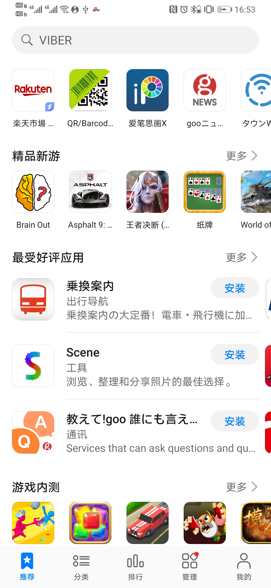

# 2. HMS体验
体验流程：注册开发者 -> 创建项目/应用 -> 集成HMS SDK -> 应用开发 -> 应用上架

## 2.1 注册开发者
使用HMS SDK必须要注册开发者账号。

### 2.1.1 华为账号注册

注册地址：https://id1.cloud.huawei.com/CAS/portal/userRegister/regbyphone.html
注意事项：注册开发者需要进行实名认证（个人或企业真实信息），账号 **国家/地区** 请谨慎选择。
TIP：应用发布可以选择全球发布或指定某个国家/地区发布，不用担心注册国内账号无法发布国外应用。

### 2.1.2 开发者实名认证

**个人账号**
住址信息 + 电话号码 + 当地身份证明（如身份证、护照、驾驶证等等）+ 银行卡

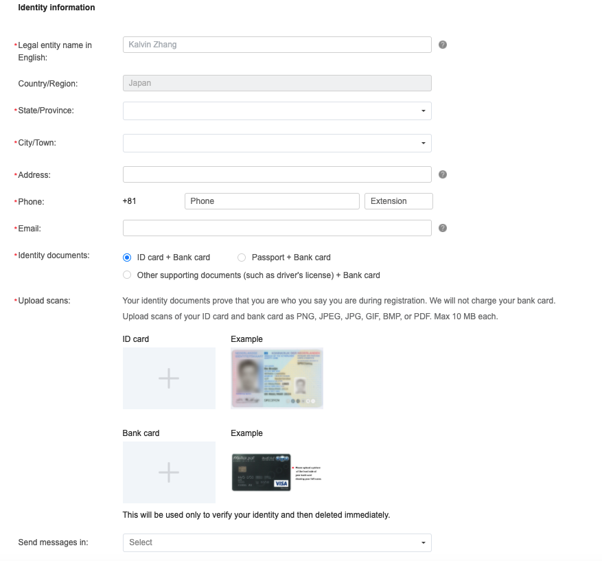

**企业账号**
企业法人、注册地 + 联系方式（电话号码+邮箱）+ 营业执照编号等等

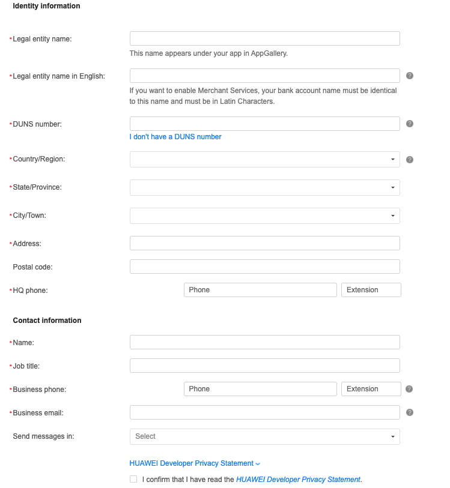

## 2.2 创建项目（应用）
华为应用管理：https://developer.huawei.com/consumer/cn/service/josp/agc/index.html
创建步骤： 我的项目 -> 新建项目 -> 添加应用（Android、iOS、快应用）-> 配置项目/应用

### 2.2.1 华为应用管理主界面
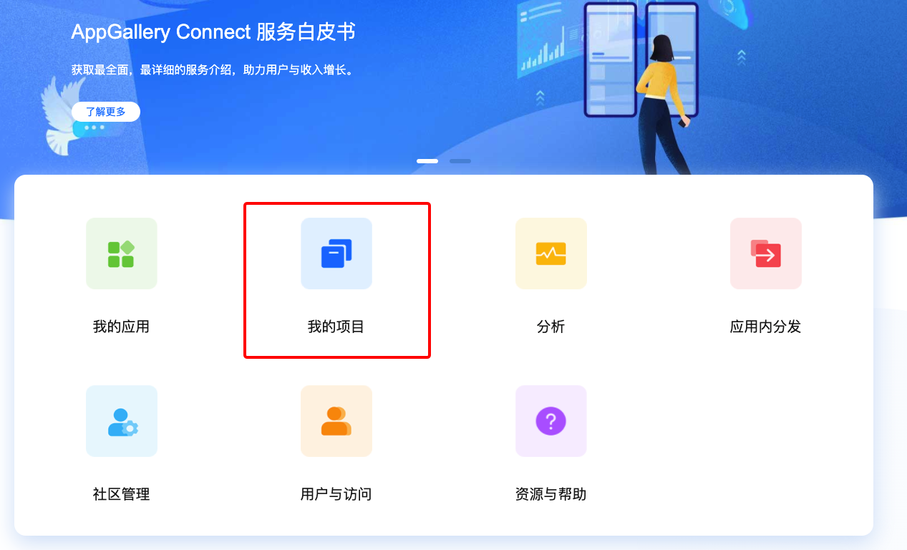

### 2.2.2 新建项目名HMS

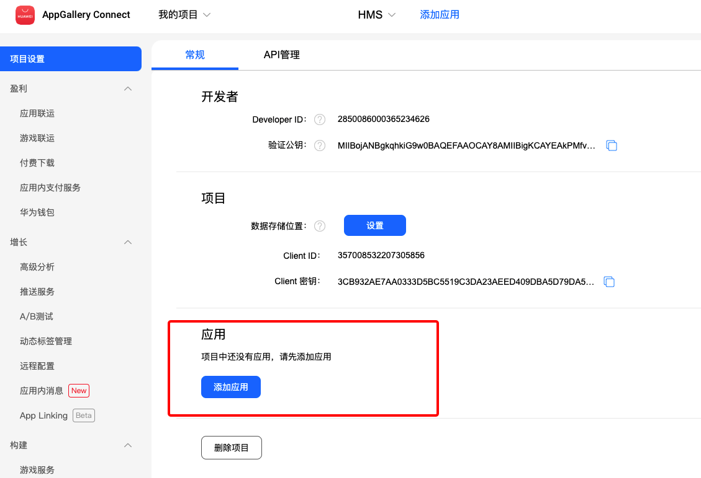

### 2.2.3 添加应用
支持 Android、iOS、快应用
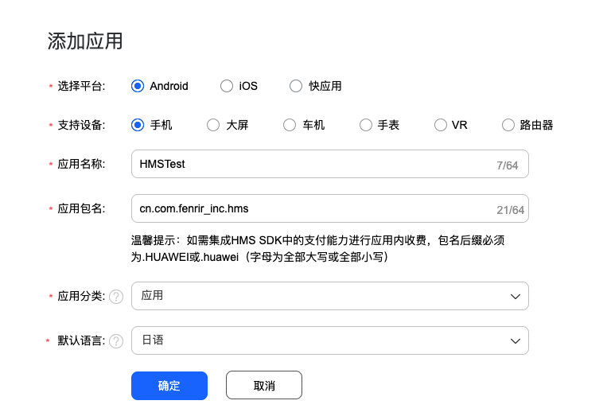

### 2.2.4 项目、应用配置

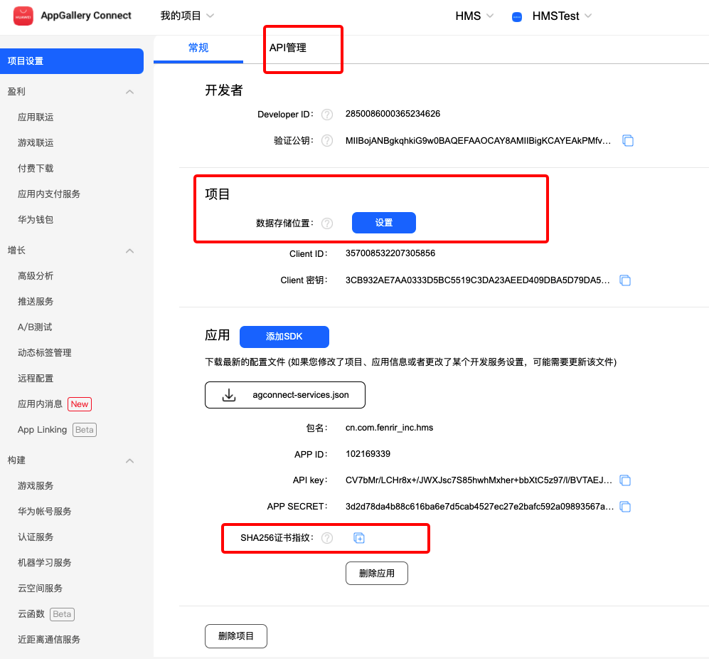

- **API 管理：**启动或关闭 HMS 提供的服务。
- **数据存储位置：**必选、会应影响上架， 与应用上架的国家/地区相关联。
- **SHA256证书指纹：**
```shell
//Debug
keytool -list -v \-alias androiddebugkey -keystore ~/.android/debug.keystore
密码；android
//Release
keytool -exportcert -list -v \-alias <your-key-name> -keystore <path-to-production-keystore>
```

## 2.3 尝试HMS推送服务
步骤：开通推送服 -> 集成SDK -> 代码编写 -> 运行获取Push Token -> 管理端测试推送

### 2.3.1 开通推送服务

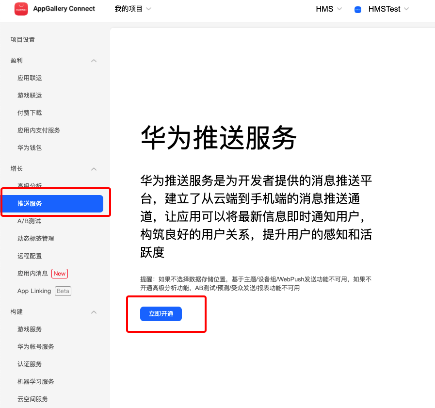

### 2.3.2 集成SDK
HMS SDK集成方式与Firebase类似，看图便知。

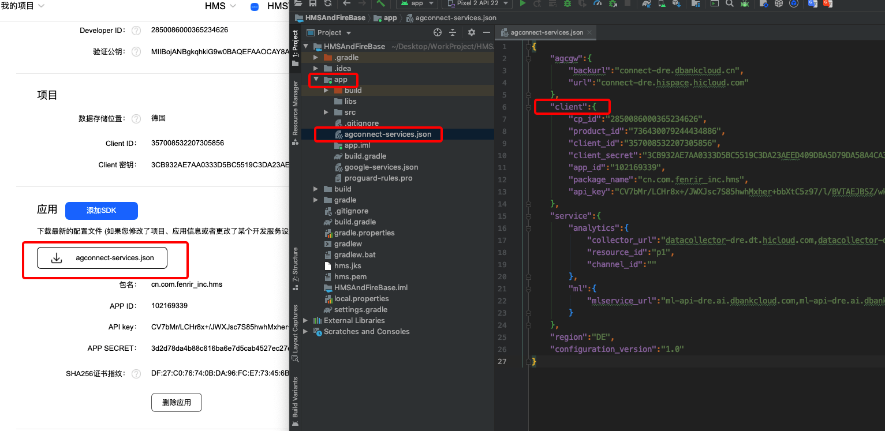

具体的集成方式请查看官方文档：[华为推送服务（HUAWEI Push Kit）SDK集成](https://developer.huawei.com/consumer/cn/doc/development/HMS-Guides/Preparations)

### 2.3.3 获取Push Token
官方文档指出：低于EMUI10.0的华为设备上，getToken接口如果返回为空，确保Push服务开通的情况下，结果后续以onNewToken接口返回。
也就是说获取Token需要使用两种方式。

**1. 调用getToken方法**
App启动后首个 activity 的 onCreate 方法调用 getToken 方法

```kotlin
    override fun onCreate(savedInstanceState: Bundle?) {
        super.onCreate(savedInstanceState)
        setContentView(R.layout.activity_main)

        Thread() {
            try {
                val appId =
                    AGConnectServicesConfig.fromContext(this).getString("client/app_id")
                val token = HmsInstanceId.getInstance(this).getToken(appId, "HCM")
                Log.i("TAG", "---get token:$token")
            } catch (e: ApiException) {
                e.printStackTrace()
            }
        }.start()

    }
```
**2. 自定义HmsMessageService**
Token发生变化时或者EMUI版本低于10.0以 onNewToken 方法返回。

```kotlin
import android.util.Log
import com.huawei.hms.push.HmsMessageService
import com.huawei.hms.push.RemoteMessage

class AppHMSMessageService : HmsMessageService() {
    override fun onCreate() {
        super.onCreate()
    }

    override fun onNewToken(token: String) {
        super.onNewToken(token)
        Log.i("TAG", "---HMS TOKEN: $token")
    }

    override fun onMessageReceived(remoteMessage: RemoteMessage) {
        super.onMessageReceived(remoteMessage)
        Log.i("TAG", "---HMS remoteMessage: $remoteMessage")
    }
}
```
AndroidManifest.xml 中注册 service

```xml
    <service
        android:name=".push.AppHMSMessageService"
        android:exported="false">
        <intent-filter>
            <action android:name="com.huawei.push.action.MESSAGING_EVENT" />
        </intent-filter>
    </service>
```

熟悉FCM的读者可以发现，上述代码与自定义**FirebaseMessagingService**基本一致，**RemoteMessage**也只是包名一样，HMS PUSH Kit 与 FCM的API设计很相似。

### 2.3.4 发送推送通知
步骤：我的项目或应用 -> 推送服务 -> 添加推送通知 -> 提交

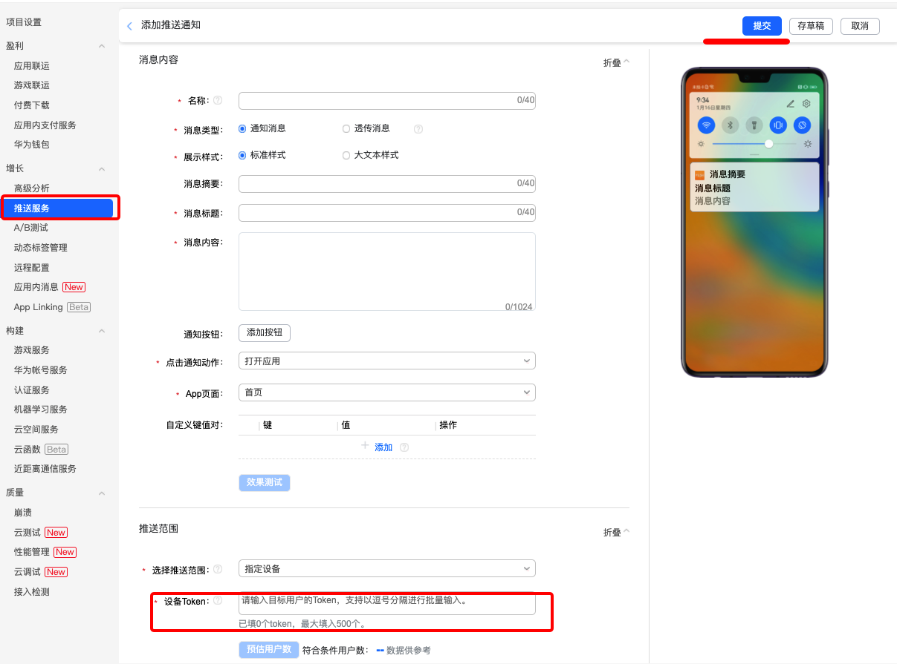

经过上述操作，手机App就可以收到通知了。

#3 华为商店应用上线
步骤：**我的应用** -> 应用详情（分发）-> 填写应用信息 -> 填写版本信息 -> 提交审核
## 3.1 应用信息
**注意：图片格式、尺寸，以及截图设备，曾经上线被拒提示：请用华为设备进行应用截图。**

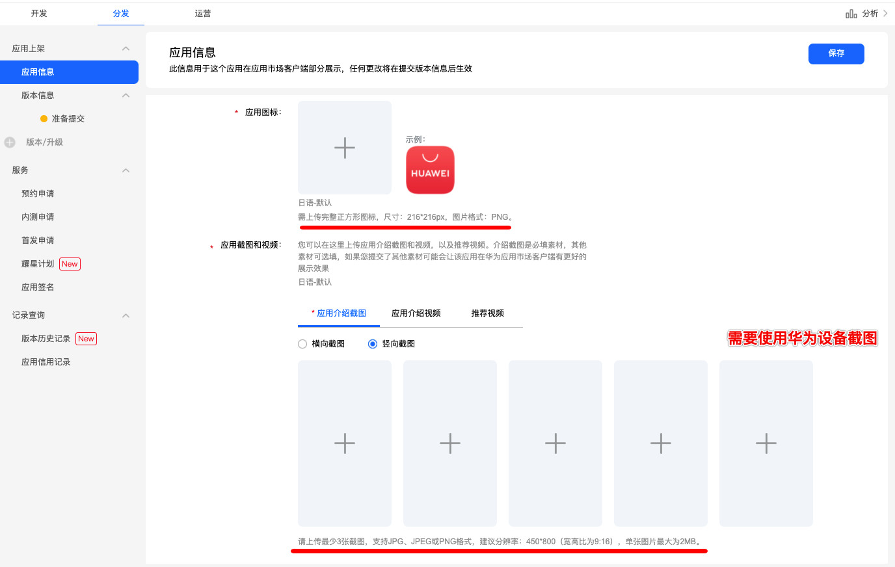

## 3.2 版本信息
### 3.2.1 上架国家和地区

可以在国家和地区中查看支持的上架区域，支持地区很多，但北美只有加拿大。

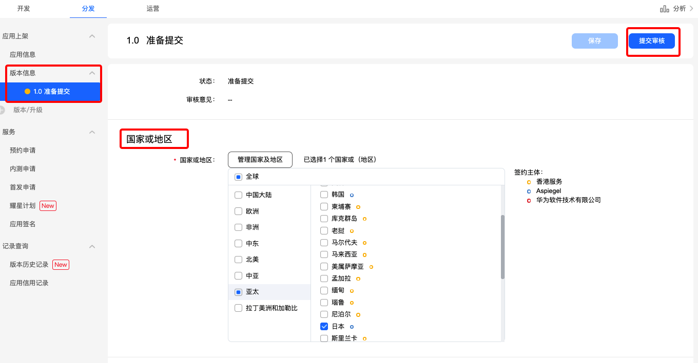

### 3.2.2 软件版本
此处需要上传app包，支持 App Bundle 或 APK。
不了解Android App Bundle的读者可查看Android 官方文档：[Android App Bundle](https://developer.android.com/platform/technology/app-bundle "Android App Bundle")

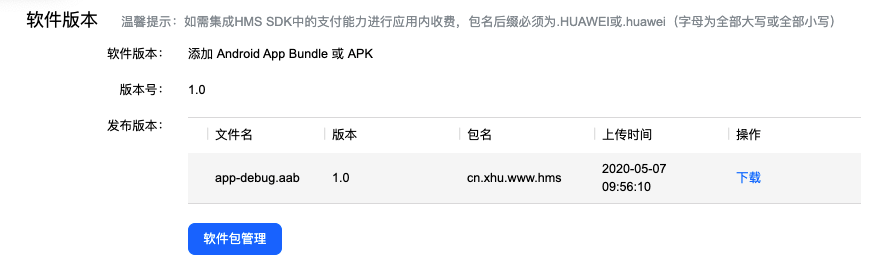

### 3.2.3 版权信息

**中国大陆**
若是在中国大陆上架应用市场（不只是华为应用商店），都是需要APP版权证书的，即需申请软件著作权。
**注意：华为应用商店还需要多上传一份免责函。** 曾因为未上传免责函而被拒。

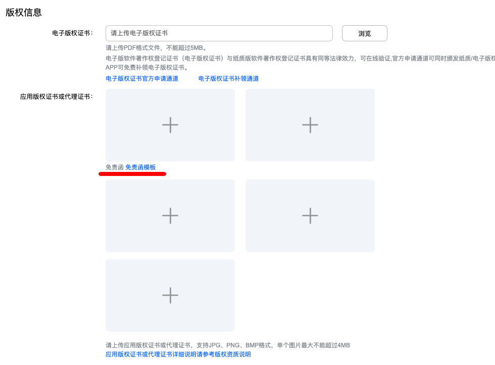

**非中国大陆**
无需任何版权信息认证，不用上传证书。

## 3.3 提交审核
应用信息与软件版本信息填写完成后，点击左上角提交审核即可。

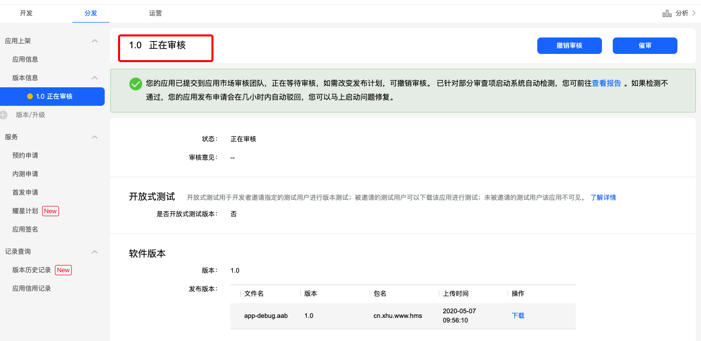

## 3.4 中国大陆上架的失败经历

1. 应用截图应为华为公司终端外观截图或不带有第三方终端品牌的应用截图
2. 应用版权未通过审核，请提供《免责函》

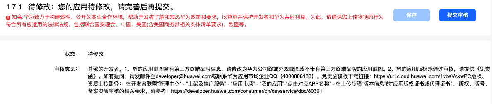

# 4. 既存项目从Firebase迁移至HMS
## 4.1 消息推送
如 2.3 尝试HMS推送服务 中所述，修改X项目中推送服务代码目前来看仅需 修改包名。
**service**
``` java
com.google.firebase.messaging.FirebaseMessagingService
//修改为
com.huawei.hms.push.HmsMessageService
```
**RemoteMessage**
``` java
com.google.firebase.messaging.RemoteMessage
//修改为
com.huawei.hms.push.RemoteMessage
```
**AndroidManifest.xml**

``` xml
<action android:name="com.google.firebase.MESSAGING_EVENT" />
//修改为
<action android:name="com.huawei.push.action.MESSAGING_EVENT" />
```
目前来看从编译运行到普通通知展示并无问题，实际开发中还需根据实际情况而定。

## 4.2 地图
项目中使用的是MapView，修改地图相关代码也只是修改包名，其它代码不变。
**布局文件**

``` xml
<com.google.android.gms.maps.MapView />
//修改为
<com.huawei.hms.maps.MapView />
```
java代码

```java
import com.google.android.gms.maps.CameraUpdateFactory;
import com.google.android.gms.maps.GoogleMap;
import com.google.android.gms.maps.OnMapReadyCallback;
import com.google.android.gms.maps.model.BitmapDescriptorFactory;
import com.google.android.gms.maps.model.CameraPosition;
import com.google.android.gms.maps.model.LatLng;
import com.google.android.gms.maps.model.MapStyleOptions;
import com.google.android.gms.maps.model.MarkerOptions;

//修改为

import com.huawei.hms.maps.CameraUpdateFactory;
import com.huawei.hms.maps.HuaweiMap;
import com.huawei.hms.maps.OnMapReadyCallback;
import com.huawei.hms.maps.model.BitmapDescriptorFactory;
import com.huawei.hms.maps.model.CameraPosition;
import com.huawei.hms.maps.model.LatLng;
import com.huawei.hms.maps.model.MapStyleOptions;
import com.huawei.hms.maps.model.MarkerOptions;
```

## 4.3 定位
X项目中虽未涉及Google 定位功能，但还是尝试了一下HMS定位服务。
**API设计一致，但HMS无API获取到详细的位置信息，如 xxx街道、小区**
实现定位步骤：
1. 通过HMS 定位服务，获取当前经纬度。
2. 通过Google Map Web API 获取详细地址信息。示例：
```
https://maps.googleapis.com/maps/api/geocode/json?latlng=40.714224,-73.961452&key=YOUR_API_KEY
```

## 4.4 HMS Core Toolkit 辅助插件

该插件为Android Studio插件，可以使用该插件来进行快速迁移。

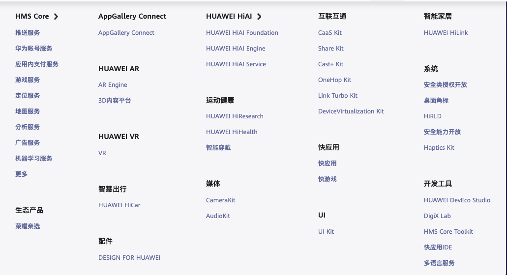

官方文档：[HMS Core Toolkit](https://developer.huawei.com/consumer/cn/doc/development/Tools-Guides/05673260 "HMS Core Toolkit")

# 5. 其它

- [快应用](https://developer.huawei.com/consumer/cn/quickApp "快应用")
- [DevEco Studio](https://developer.huawei.com/consumer/cn/doc/development/Tools-Guides/3141903 "DevEco Studio")
- [统一扫码服务](https://developer.huawei.com/consumer/cn/hms/huawei-scankit "统一扫码服务") ：扫码效果各方面比Zxing好很多
- [华为开发者官网](https://developer.huawei.com/consumer/cn/develop/ "华为开发者官网")
