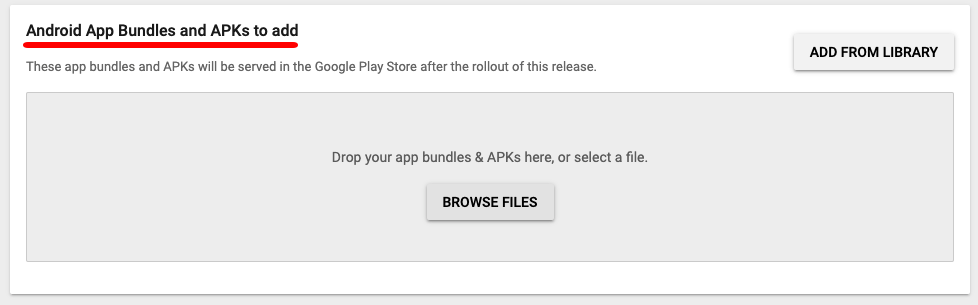
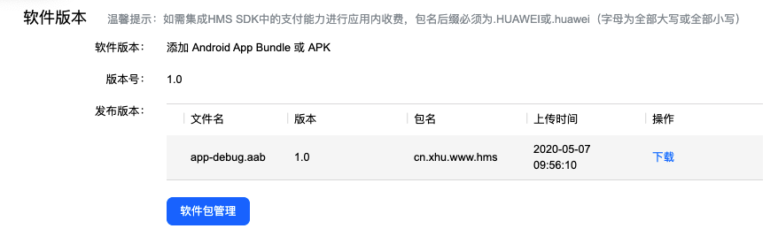
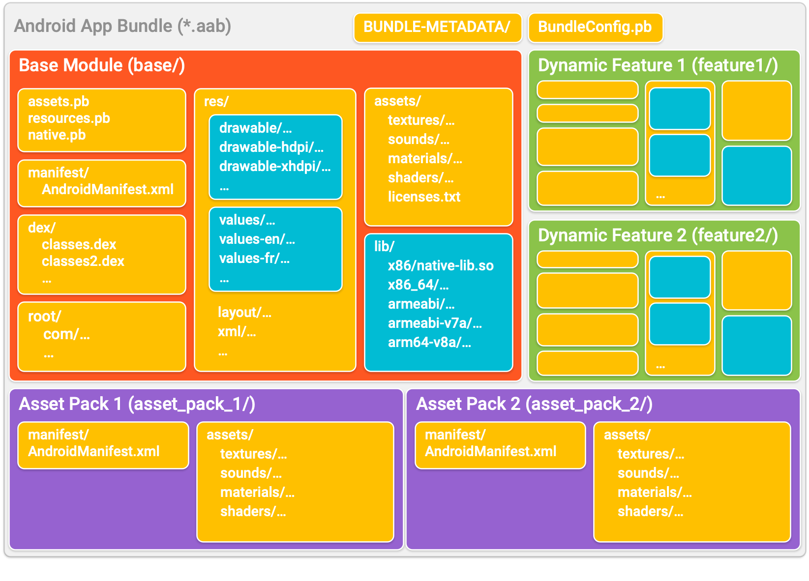
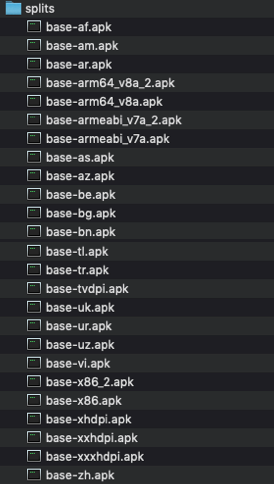
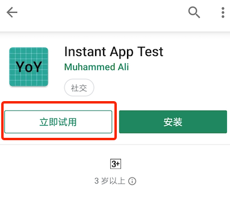
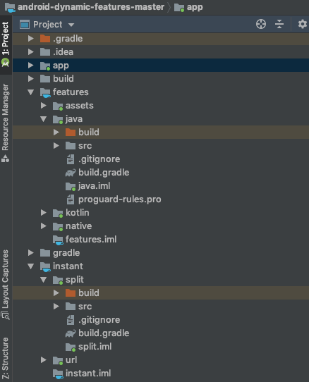

# Android App Bundle

---

## 1. 简介

Android App Bundle 是Android新推出的一种官方发布格式，采用这种方式可以实现`减小APK体积`、`提供Google Play免安装体验`、`模块化应用开发`和`自定义功能交付`等功能，支持Android 5.0及其以上。

[Android App Bundle官方文档](https://developer.android.com/platform/technology/app-bundle)

当前支持App Bundle格式的应用市场有Google Play、华为应用市场（AppGallery）。

**Google Play**


**华为应用市场**



## 2. 怎样实现减小APK体积

`以下内容引用官方文档的介绍`

App bundle 是经过签名的二进制文件，可将应用的代码和资源整理到模块中，如图所示。



各个模块的代码和资源的组织整理方式与 APK 中的相似，每个模块都可以作为单独的 APK 生成。然后，Google Play 会使用 app bundle 来生成向用户提供的各种 APK，例如基本 APK、动态功能 APK、配置 APK 以及多 APK（对于不支持拆分 APK 的设备）。

特别是**res**中的图片资源、**lib**中的.so文件，若只针对某一特定手机屏幕、架构而抛弃其它用于适配的资源文件，APK会小很多，而.aab格式就是经过应用市场的处理，生成适合当前手机的apk,从而实现减小APK体积。

## 3. App Bundle 打包
- 命令打包：`./gradlew :app:bundleDebug` : app为主Module名称，不同项目需替换。
- Android Studio：Build -> Build Bundle(s)/APK(s) -> Build Bundle(s)
- Android Studio：Build -> Generate Signed Bundle or apk -> Android App Bundle

默认输出路径：app/build/outputs/bundle/debug or release/*.aab
Android App Bundle文件为` .aab`后缀结尾。

## 4. App Bundle 安装
`.aab`文件是无法直接安装的，正常情况下是由Google Play处理，根据用户当前的手机信息将 .aab 文件生成适配的 .apk 文件供用户下载。不过在开发过程中我们可以使用`bundletool`来测试我们的.aab文件。

### 4.1 bundletool
bundletool：是Gradle，Android Studio和Google Play用于构建Android应用包或将应用包转换为部署到设备的各种APK的基础工具。
- 下载地址：https://github.com/google/bundletool/releases
- 官方文档：https://developer.android.com/studio/command-line/bundletool
- 使用方式：java -jar bundletool.jar ...

### 4.2  生成.apks
将.aab文件转换为.apks文件
```
bundletool build-apks --bundle = /MyApp/my_app.aab --output = /MyApp/app_normal.apks
```
生成特定设备的.apks
```
bundletool build-apks --connected-device --bundle = /MyApp/my_app.aab --output = /MyApp/app_hauwei.apks
```
解压.apks 并查看文件，可以发现.apks是不同特征的.apk文件的集合。



### 4.3  安装.apks
```
bundletool install-apks --apks = /MyApp/app_normal.apks
```
安装对比

|文件名称|包体积(M)|安装后体积(M)|备注(同一设备)|
|--|--|--|--|
|app_normal.aab|14.8|~|无法直接安装|
|app_normal.apk|16|25.99|普通APK|
|app_normal.apks|44.8|12.52|未处理的.apks|
|app_huawei.apks|12.5|12.52|针对特定机型生成的.apks|
|app_simulator.apks|13|~|模拟器|

结论：确实使用 .aab 格式用户下载以及安装的App体积比 .apk格式的小，app_huawei.apks中只包含适配该手机特征的 res、assets、lib。

## 5. App Bundle 动态功能模块
App Bundle 格式配合 Play Core Library 可以实现动态功能投放。
开发过程中将App分为基础APK、动态功能APK，并以.aab格式发布，用户下载安装时只下载基础APK，在特定的时机（例如活动、VIP用户）在下载动态功能模块。

### 5.1 动态功能模块创建
File -> New -> New Module -> Dynamic Feature Module /Instant Dynamic Feature Module

- Dynamic Feature Module ：动态功能模块
- Instant Dynamic Feature Module ：即时应用功能模块
详细介绍：https://developer.android.com/topic/google-play-instant/getting-started/feature-plugin

Google Play即时应用功能



点击 **立即试用** 可不用下载App便体验App。

### 5.2  Play Core库使用
使用Play Core Library 可以实现对动态功能模块进行请求、下载，合并，立即使用、卸载等。

- 详细用法查看：https://developer.android.com/guide/app-bundle/playcore
- 官方示例代码：https://github.com/googlesamples/android-dynamic-features

## 6. 其它相关
对应Android App Bundle 还引伸出其它相关内容。

官方示例Demo代码结构：



- app：基本模块
- features：动态功能模块
- instant ：即时应用功能模块

如何访问动态功能模块代码：https://medium.com/androiddevelopers/patterns-for-accessing-code-from-dynamic-feature-modules-7e5dca6f9123

构建模块化应用程序架构：https://www.youtube.com/watch?v=PZBg5DIzNww
