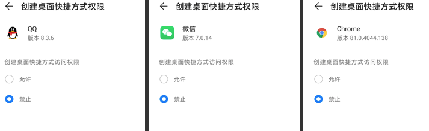

# 创建桌面快捷方式——华为手机兼容

---

## 1. 不兼容的现象

通过App创建桌面快捷方式，在其它手机都可以创建成功，只是因为系统版本、手机厂商的不同会有些行为差异，但在华为手机上却无法创建成功。

## 2 创建桌面快捷方式

**kotlin代码**

```kotlin
    private fun createShortCut() {
        val context = this
        if (!ShortcutManagerCompat.isRequestPinShortcutSupported(context)) return

        val iconBitmap = BitmapFactory.decodeResource(context.resources, R.mipmap.ic_launcher)
        val launchIntent = Intent().apply { action = Intent.ACTION_VIEW; }
        //快捷式样信息
        val shortcutInfo = ShortcutInfoCompat.Builder(context, "id")
            .setIcon(IconCompat.createWithBitmap(iconBitmap))
            .setShortLabel("shortcut name")
            .setIntent(launchIntent)
            .build()

        val shortcutCallbackIntent = PendingIntent.getBroadcast(
            context,
            0,
            Intent(context, CreateShortCutReceiver::class.java),
            PendingIntent.FLAG_UPDATE_CURRENT
        )
        //申请创建快捷方式
        ShortcutManagerCompat.requestPinShortcut(
            context,
            shortcutInfo,
            shortcutCallbackIntent.intentSender
        )
    }

    class CreateShortCutReceiver : BroadcastReceiver() {
        override fun onReceive(context: Context, intent: Intent) {
            Toast.makeText(context, "create success", Toast.LENGTH_SHORT).show()
        }
    }
```

**权限申请**
```xml
    <uses-permission android:name="com.android.launcher.permission.INSTALL_SHORTCUT" />
    <uses-permission android:name="com.android.launcher.permission.UNINSTALL_SHORTCUT" />
```

## 3 不兼容的原因

华为手机自定义了 创建快捷方式权限 的行为，必须要手动开启。创建快捷方式权限非危险权限，不能动弹申请权限。

|机型|系统版本|权限|是否可以创建成功|
|-|-|-|-|
|小米5|8.0|默认有权限|可以|
|Pixel2|7.0|默认有权限|可以|
|Pixel XL|9.0|默认有权限|可以|
|荣耀V8|8.0|无权限，需手动开启|不可以|
|华为P30|10.0|无权限，需手动开启|不可以|

可以发现华为手机上QQ、微信、Chrome也是一样默认禁止，需要手动开启。




## 4 解决方法

设备系统8.0以下申请权限，8.0以上不申请权限即可。

### 原因

首先看判断是否支持创建快捷方式的源码

```java
public static boolean isRequestPinShortcutSupported(@NonNull Context context) {
    //8.0及其以上通过系统服务来判别
    if (Build.VERSION.SDK_INT >= 26) {
        return context.getSystemService(ShortcutManager.class).isRequestPinShortcutSupported();
    }
    //8.0以下通过是否具有安装快捷方式的权限来判断
    if (ContextCompat.checkSelfPermission(context, INSTALL_SHORTCUT_PERMISSION)
            != PackageManager.PERMISSION_GRANTED) {
        return false;
    }
    for (ResolveInfo info : context.getPackageManager().queryBroadcastReceivers(
            new Intent(ACTION_INSTALL_SHORTCUT), 0)) {
        String permission = info.activityInfo.permission;
        if (TextUtils.isEmpty(permission) || INSTALL_SHORTCUT_PERMISSION.equals(permission)) {
            return true;
        }
    }
    return false;
}
```

### 修改代码

```xml
    <uses-permission
        android:name="com.android.launcher.permission.INSTALL_SHORTCUT"
        android:maxSdkVersion="25" />
    <uses-permission
        android:name="com.android.launcher.permission.UNINSTALL_SHORTCUT"
        android:maxSdkVersion="25" />
```

没有华为8.0以下的手机进行测试，不过理论上述解决方式在5.0 ~ 8.0之间的华为手机上任然不行，<br>
所以还应该弹窗提醒用户，在应用设置界面手动打开创建快捷方式的权限.
