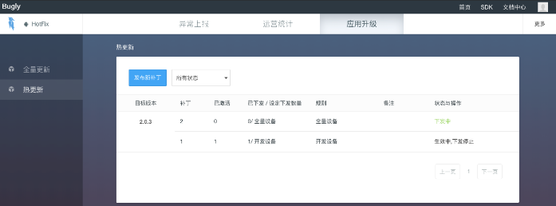

# Android热修复框架简单介绍

## 1. 简介
热修复：上线App发现bug后无需发布新版本，通过下发补丁包的方式，使用App应用补丁修复bug。

上架Google Play Store时不建议使用，有禁止上架的风险。

## 2. 方案介绍
- [淘宝 Dexposed](https://github.com/alibaba/dexposed)
- [支付宝 AndFix](https://github.com/alibaba/AndFix)
- [淘宝、阿里云 Sophinx(付费)](https://help.aliyun.com/product/51340.html?spm=5176.131995.673114.doc_11.581169fddMPdHR)
- [QQ空间：未开源、只有相关技术介绍](https://mp.weixin.qq.com/s?__biz=MzI1MTA1MzM2Nw==&mid=400118620&idx=1&sn=b4fdd5055731290eef12ad0d17f39d4a)
- [微信 Tinker](https://github.com/Tencent/tinker)
- [美团点评 Robust](https://github.com/Meituan-Dianping/Robust)
- [饿了么 Amigo](https://github.com/eleme/Amigo)

还在更新的库：Sophinx、Tinker、Robust

|方案对比|Sophinx|Tinker|Robust|
|-|-|-|-|
|类替换|yes|yes|no|
|So替换	|yes|yes|no|
|资源替换|yes|yes|no|
|全平台支持|yes|yes|yes|
|即时生效|yes|no|yes|
|补丁包大小|小|小|一般|
|成功率|高|高|最高|

## 3. 热修复分类
### 3.1 代码修复

- 底层替换：在已加载的类中直接在native层替换掉原有方法。
- 类加载：app重新启动时，让Classloader去加载新的类。

### 3.2 资源修复

- Instant Run资源修复 : 创建New_AssetManager，反射获取 `addAssetPath`方法，将资源加入新的New_AssetManager。然后找到引用了Old_AssetManager的地方，通过反射替换为New_AssetManager。
- 构建package id不重复的资源包，直接使用AssetManager.addAssetPath()添加资源。

#### 资源package id 介绍

使用[aapt2](https://developer.android.com/studio/command-line/aapt2) （\~/Android/sdk/build-tools/\~/aapt2）

查看 resources id
```
aapt2 d resources apptest.apk 
```
得到信息
```
type anim id=01 entryCount=26
resource 0x7f010000 anim/abc_fade_in(file) res/anim/abc_fade_in.xml type=XML
...
type drawable id=08 entryCount=428
resource 0x7f080007 drawable/a01_01_footer (file) res/drawable/a01_01_footer.xml type=XML
...
```
- package id：0x7f 
- type id：0x08
- 0x7f080007：代表packageId为0x7f Type为0x08的第0x0007项。

由Android SDK打包的apk资源包的 package id：0x7f 
系统资源包(framework-res.jar) package id：0x01

### 3.3. SO修复
- 手动替换系统System.load()方法
- 反射注入：将补丁so库的路径插入到nativeLibraryDirectories数组的最前面。

## 4. 方案选择
未更新的库不考虑，除去Sophinx、Tinker、Robust，其他库都是几年未更新。
Sophinx：功能完善、大厂背景、技术支持、提供补丁分发监控平台、未开源需付费。
Tinker：功能完善、大厂背景、提供补丁分发监控平台、性能稍弱于Sophinx，开源免费
Robust：只是在正常的使用DexClassLoader （[Robust核心代码](https://github.com/Meituan-Dianping/Robust/blob/cda1436c8efb95395625bddb65868a96767f9461/patch/src/main/java/com/meituan/robust/PatchExecutojava)）、高稳定性、开源免费、但功能少且不提供补丁分发监控平台

综合选择 Tinker，当前有两个平台支持Tinker补丁下发与监控，分别是
bugly（https://bugly.qq.com/）
Tinker Platform(http://tinkerpatch.com/)

## 5. 方案实施

[Tinker接入指南](https://github.com/Tencent/tinker/wiki/Tinker-%E6%8E%A5%E5%85%A5%E6%8C%87%E5%8D%97)

后台管理平台SDK接入指南：
- [bugly](https://bugly.qq.com/docs/user-guide/instruction-manual-android-hotfix/?v=20180709165613)
- [TinkerPatch](http://www.tinkerpatch.com/Docs/SDK)

流程：
1. bugly 热更新 SDK接入
2. 正常打包APK（base.apk）
3. 启动base.apk 联网上报
4. 修改代码，使用Tinker Gradle 插件，基于base.apk生成补丁apk
5. bugly控制台->应用升级->热更新->发布新补丁->上传补丁apk


